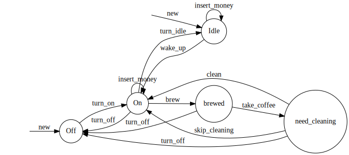

# Rust Typestate Patterns

RTP ;-) is a typestate-based deterministic state machine for your structs!
RTP will guarantee your specified control-flow without any overhead past
the initial compilation. It is therefore especially suited for embedded
devices and critical applications runnning in weak hardware environments.
RTP saves you a lot of runtime checks, enforces your defined control flow
and makes analyzing and testing your code easier. It also helps you to
visualize and prove your control flow by generating .svg graphics of
your underlying state machine and prints all generated code into a debug
file for easier maintenance, debugging and error correction.



## Quick Start

Add [typestate] to your Cargo.toml file, examples can be found [here].

[typestate]: link/to/crates/io/typestate
[here]: examples/

## Examples

Let's look at some short examples! If you want a deeper understanding of what you can do
also check out the other examples found [here].

[here]: examples/

__0. Importing the library__

Add the following to your Cargo.toml:
```toml
[dependencies]
typestate = "1.0.0"
```

Add the following to your code:
```rust
extern crate typestate;

use typestate::{ add_states, constructor, impl_for, just_a_comment, require_state, transition };
```

__1. Adding states to your struct__
```rust
// New code
// We add the states "Off" and "On" to our struct "SimpleMachine".
#[add_states(
    "States: Off, On;
    Transitions: "
)]

// Your code
struct SimpleMachine {name: String}
```

__2. Adding transitions between your states__
```rust
// New code
// We add transitions between Off and On, both can transition back and forth.
#[add_states(
    "States: Off, On;
    Transitions:
        Off -> On,
        On -> Off"
)]

// Your code
struct SimpleMachine {name: String}
```

__3. Augmenting your implementation with transitions__
```rust
// New code
#[impl_for]
// Your code
impl SimpleMachine {

    // New code: "turn_on" will transition from state "Off" to state "On".
    // This implicitly enforces that the machine is in state "Off" and that
    // the transition from "Off" to "On" is defined.
    #[transition(Off -> On)]
    // Your code
    fn turn_on(self) {
        println!("Machine is now in state 'On'.");
    }

    // New code: "turn_off" will transition from state "On" to state "Off".
    #[transition(On -> Off)]
    // Your code
    fn turn_off(self) {
        println!("Machine is now in state 'Off'.");
    }
}
```

__4. Requiring states__
```rust
// New code
#[impl_for]
// Your code
impl SimpleMachine {

    // New code
    // If you don't want to perform a transition but your function should only be
    // executed in a specific set of states use the 'require_state' macro.
    #[require_state(On)]
    // Your code
    fn print_name(&self) {
        println!("My name is {:?} and my state is 'On'.", self.name );
    }
}
```

__5. Defining constructors__
```rust
// New code
#[impl_for]
// Your code
impl SimpleMachine {

    // New code
    // You must specify a constructor because the library needs it to init a new object.
    // The specified state is the initial state of the corresponding state machine.
    #[constructor(Off)]
    // Your code
    fn new() -> SimpleMachine {
        println!("Creating a new machine. The init state is 'Off'.");
        SimpleMachine {name: "test123".to_string()}
    }
```

__6. Using your augmented struct__
```rust
// Your code
fn main() {
    let machine = SimpleMachine::new();
    let machine = machine.turn_on();
    machine.print_name();
    // Calling machine.turn_on() here would
    // halt the compilation since the machine
    // is already in state "On".
    machine.turn_off();
}
```

## Debug
The lib will create a folder 'debug' in the root folder of your project with the following content:  
_1. STRUCTNAME_generated_states.rs_  
_2. STRUCTNAME_possible_transitions.gv_  
_2. STRUCTNAME_used_transitions.gv_  

The first one is the code that was generated by the lib. You can format it with 'rustfmt' for better reading. It will help a lot if you want to see how your code is translated.  
With 2. and 3. you can see your statemachine as a graph. For that you first need to install the package *graphviz*. Then you can execute the following command <code>dot -Tsvg INPUT -o OUT.svg</code>.  
STRUCTNAME_possible_transitions.gv contains a graph of all possible transitions. These are all specified transitions in add_states.  
STRUCTNAME_used_transitions.gv only contains all transitions that are possible because there exists a function for that transition.

### Compiler errors
Here is a list with short descriptions of common compiler errors. These compiler checks will guarantee that you cannot use invalid transitions.

+ error[E0308]: mismatched types expected struct `SimpleMachine_state_Off`, found struct `SimpleMachine_state_On`   
This error occurs if you try to implement a transition in your impl (with the transition macro) that does not exist (was not added in the add_states macro).
For an example see [example1].

+ error[E0599]: no method named XXX found for type `SimpleMachine<SimpleMachine_state_On>` in the current scope   
This error occurs if you try to call a function from a wrong state.
For an example see [example2] and [example3].

+ error: cannot find attribute `require_state` in this scope, error[E0412]: cannot find type `SimpleMachine_state_nonExisting` in this scope    
You are trying to use a state in the transition or require_state macro that was not defined in the add_states macro.
For an example see [example4].

+ error[E0412]: cannot find type `SimpleMachine_state_On` in this scope   
You are trying to add a transition in the add_states macro but you forgot to add your used states to the states list.
For an example see [example5].

[example1]: examples/wont_compile/example1.rs
[example2]: examples/wont_compile/example2.rs
[example3]: examples/wont_compile/example3.rs
[example4]: examples/wont_compile/example4.rs
[example5]: examples/wont_compile/example5.rs
## License

See [LICENSE](LICENSE) for details.
